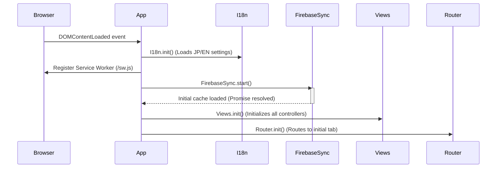

# Seibi Application: Architecture Map

This document describes the modular architecture of the Seibi application. It maps out the directory layout, design rules, and data flows. Refer to this document whenever refactoring existing files or adding new components.

---

## 1. Directory Structure & Layers

The project follows a strict **Separation of Concerns** using an Immediately Invoked Function Expression (IIFE) architecture in Vanilla JavaScript. The codebase is divided into four distinct layers:

```
public/js/
├── components/          # LAYER 1: UI COMPONENTS (Pure HTML/SVG generation)
│   ├── asset-card.js    # Renders equipment cards and status badges
│   ├── calendar-grid.js # Renders calendar tables, headers, and task pills
│   ├── notice-card.js   # Renders notice board posts and resolution banners
│   └── wiremap-svg.js   # Renders background SVG room walls, grids, and wire overlays
│
├── services/            # LAYER 2: BUSINESS SERVICES (Pure logic, math, & validation)
│   ├── asset-service.js # Groups assets by category; validates asset registration
│   ├── calendar-service.js # Formats JST dates; translates days/months; filters tasks
│   ├── notice-service.js # Formats relative time; selector for avatar colors; filters notices
│   ├── wiremap-service.js # Workshop canvas bounds; clips coordinate bounds during drag
│   └── notifications.js # Handles local browser and background PWA notifications
│
├── views/               # LAYER 3: VIEW CONTROLLERS (DOM bindings, modals, and user events)
│   ├── assets.js        # Controller for equipment tab, checklist modals, and registration
│   ├── calendar.js      # Controller for calendar day drawers and pointer drag events
│   ├── history.js       # Controller for historical logs list
│   ├── home.js          # Controller for daily tasks checklist
│   ├── manual.js        # Controller for PDF guide viewer
│   ├── notice.js        # Controller for notice board compose, search, and resolution form
│   └── wiremap.js       # Controller for layout editor drag events and wire details panel
│
└── data/                # LAYER 4: DATA STORES (Firebase configuration & initial seeds)
    ├── firebase-config.js # Firebase app initialization and real-time syncing loaders
    └── assets.js        # Static master checklists and templates registry
```

---

## 2. Design Rules & Guidelines

When extending the application, you must follow these architectural boundaries:

1.  **Component Layer rules:**
    *   Components must ONLY return HTML or SVG markup strings.
    *   No DOM queries (`document.getElementById`) or click listeners allowed. 
    *   No direct communication with Firebase or data stores.
2.  **Service Layer rules:**
    *   Services must contain pure JavaScript calculations, mappings, or validation.
    *   No HTML tags or DOM elements are permitted.
    *   Keep services stateless and function-driven.
3.  **View Controller Layer rules:**
    *   Views are responsible for DOM interaction, query selectors, showing/hiding modals, and attaching click/drag events.
    *   Views trigger refreshes when data is synced or when the language switcher is toggled.
4.  **Load Order (index.html):**
    *   Because the app does not use ES Modules (`type="module"`), script tags must load sequentially.
    *   Load order must always be: **Data/Configs -> Services -> Components -> Views -> app.js**.

---

## 3. Application Boot Lifecycle

On page load, the application executes the following bootstrap sequence:



---

## 4. Real-time Data Synchronization Flow

Firebase Realtime Database is the Single Source of Truth. The synchronization pipeline flows as follows:

1.  **Read Listener:** On boot, `FirebaseSync.js` registers `.on('value')` listeners on the main database nodes (`/assets`, `/tasks`, `/notices`, `/history`, `/templates`).
2.  **Memory Cache:** When data updates in the cloud, the listener updates the local cache: `FirebaseSync.cache`.
3.  **View Notification:** Once the memory cache is updated, the sync handler calls the corresponding view refresh functions:
    *   *Example:* Assets update -> calls `AssetsView.refresh()` and `HomeView.refresh()`.
4.  **Write/Action:** UI actions write directly to the database path using `.set()` or `.push()`. They do not modify the local cache directly—the `.on('value')` listener handles updating the cache and UI, ensuring real-time consistency across all active clients.
