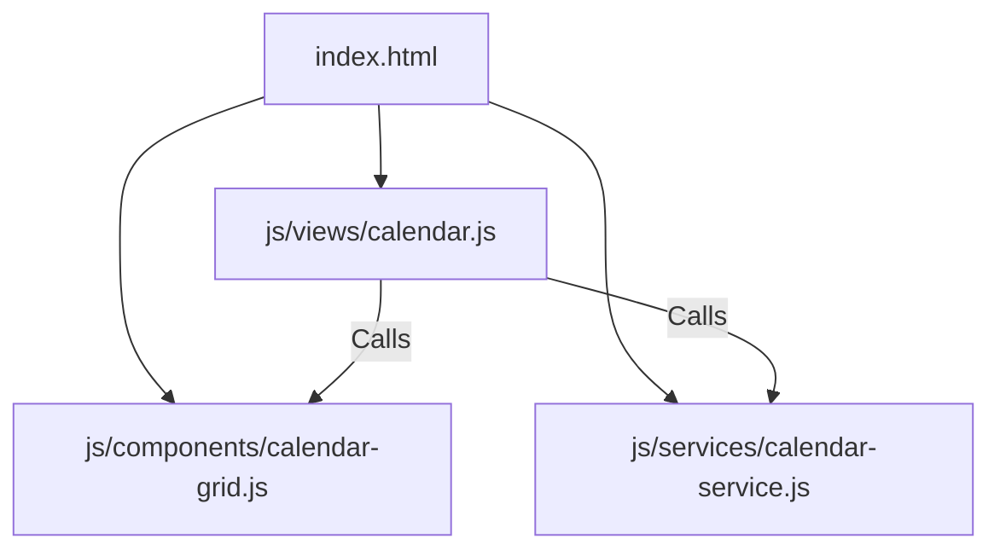

# Implementation Plan: Modular Refactoring of Calendar View

This plan describes how to refactor the monolithic public/js/views/calendar.js (26 KB, 570 lines) into three clean, single-responsibility files using the existing IIFE (Immediately Invoked Function Expression) architecture.

---

## User Review Required

* **Script Loading Order:** Since this project uses standard script tags instead of ES Modules, the new component and service files must be loaded in public/index.html **before** the main view file.
* **No Structural Break:** We will not convert the codebase to modern ES module imports (type="module"), as doing so would require rewriting how all global namespaces (App, I18n, Router) interact. We will stick to the project's current robust global namespace system.

---

## Proposed Changes

We will split the Calendar view logic into three distinct layers:
1. **Component Layer (js/components/calendar-grid.js):** Renders HTML strings for the calendar navigation header, day column names, day cells, and priority-colored task pills.
2. **Service Layer (js/services/calendar-service.js):** Pure date calculations and calendar logic (JST date formatting, timezone adjustments, translating months/days, and sorting tasks by date).
3. **Controller Layer (js/views/calendar.js):** Handles DOM bindings, month prev/next/today navigation actions, pointer events for unified mouse + touch drag-and-drop, and the calendar day detail drawers.



---

### 1. Create [NEW] js/components/calendar-grid.js
Extract all HTML string-building functions from the view. This file only concerns itself with how visual layers are generated.

* **Functions to extract:**
  * _renderHeader(year, month): Generates month prev/next navigation bar.
  * _renderDayHeaders(): Generates column header names (Sun, Mon, Tue...).
  * _renderPill(task): Generates HTML for visual task pills with priority classes.

---

### 2. Create [NEW] js/services/calendar-service.js
Extract constants, coordinates, and bounding box validation logic. This file has no DOM dependencies and is purely functional.

* **Functions to extract:**
  * _getMonthNames(), _getDayNames(): Dynamic translation lists based on `I18n.getLang()`.
  * _toDateStr(year, month, day), _todayStr(): Date string formatting.
  * _tasksForDate(tasks, dateStr): Helper to filter tasks by due date.

---

### 3. [MODIFY] js/views/calendar.js
We will clean up the view controller. It will now only bind click listeners, modal overlays, detail side panel text, and trigger database saves.

* **Key cleanups:**
  * Delete `_renderHeader`, `_renderDayHeaders`, and `_renderPill` (use the new `CalendarGrid` component namespace).
  * Delete config lists and dates formatting (use the new `CalendarService` namespace).

---

### 4. [MODIFY] public/index.html
Register the new files in the scripts section, ensuring they load in the correct order.

```diff
  <script src="js/views/home.js?v=34"></script>
+ <script src="js/components/calendar-grid.js?v=34"></script>
+ <script src="js/services/calendar-service.js?v=34"></script>
  <script src="js/views/calendar.js?v=34"></script>
  <script src="js/views/history.js?v=34"></script>
```

---

## Verification Plan

### Automated Verification
* Open browser Developer Tools and check the console. Ensure no load-order errors occur (Uncaught ReferenceError: CalendarGrid is not defined).
* Run git diff on calendar.js to ensure code line count decreases significantly.

### Manual Verification
1. **Calendar View Check:** Open the "Home" tab and toggle to "Calendar". Verify the calendar navigation headers and grid cells render properly with correct localized day names.
2. **Pill & Drawer Check:** Click on any day cell with tasks. Verify the day drawer slides open and displays all tasks correctly.
3. **Rescheduling Check:** Perform a drag-and-drop or touch reschedule of a task pill. Verify it updates the database, updates the daily checklist, and renders the updated schedule correctly.
