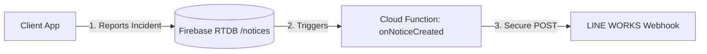

# Implementation Plan: LINE WORKS Incident Notifications (With Mentions)

This plan describes how to integrate LINE WORKS with the Seibi application. When a technician logs a sudden incident or defect in the app, the system will instantly send a formatted notification to the team's LINE WORKS talkroom, with support for target mentions (like @All or specific users).

---

## Architecture Design: Cloud Database Trigger

Instead of making the HTTP call from the client-side browser, we will use a **Firebase Cloud Function Database Trigger**. 



### Why this is the right design:
1. **Security:** The LINE WORKS Webhook URL is hidden inside the backend Cloud Function. No one can steal the URL from the browser's Developer Tools to spam your channel.
2. **No CORS Issues:** Browsers block direct POST requests to messaging webhooks due to Cross-Origin Resource Sharing (CORS). Cloud Functions run on Node.js and bypass this.
3. **Offline Resilience:** If a technician reports a defect while offline, Firebase offline cache saves it. As soon as they regain connection, the database updates, triggering the cloud function and sending the notification.

---

## Step-by-Step Integration Guide

### Step 1: Set up the LINE WORKS Webhook (Manual Setup)
Before executing the code changes, you or your Senpai must generate the Webhook URL:
1. Go to your **LINE WORKS Developer Console** or **App Directory** and search for the **Incoming Webhook** app.
2. Add the app, choose a title (e.g., `Seibi Notice Bot`), and invite it to the target talkroom where notifications should go.
3. Under the Webhook settings, copy the generated **Webhook URL** (it looks like `https://webhook.worksmobile.com/r/xxxxxx/xxxxxx`).

---

### Step 2: Implement the Cloud Function with Mentions
We will add a new trigger function to [functions/index.js](file:///C:/Users/SHOP4/.gemini/antigravity/scratch/seibi-app/seibi-app-main/functions/index.js).

* **Target File:** [functions/index.js](file:///C:/Users/SHOP4/.gemini/antigravity/scratch/seibi-app/seibi-app-main/functions/index.js)
* **Trigger Event:** `onValueCreated` (or `ref('notices/{noticeId}').onCreate`) in Firebase Realtime Database.
* **Logic:**
  1. Retrieve the new notice payload (incident title, asset name, severity/priority, author, and description).
  2. Format the message content in both Japanese and English.
  3. Send an HTTP POST request to the LINE WORKS Webhook URL.

#### How Mentions Work in LINE WORKS Webhooks:
To tag a user or notify everyone, you place a special tag inside the `text` field:
* **To Mention Everyone:** Use `<m userId="all">` (renders as `@All` and triggers notifications for everyone).
* **To Mention a Specific User:** Use `<m userId="senpai@company.com">` (replaces `{email}` with their registered corporate email, rendering as `@Senpai` and triggering a direct notification).

#### Example Notification Format (JSON Payload):
```json
{
  "title": "🚨 異常発生通知 (Incident Alert)",
  "body": {
    "text": "<m userId=\"all\">\n新しい異常報告が届きました。\n\n■ 設備名 (Equipment): Robot #3\n■ 内容 (Details): 溶接ノズルにスパッタ付着、動作一時停止。\n■ 報告者 (Reporter): John Doe\n■ 日時 (Time): 2026-06-23 17:15"
  },
  "button": {
    "label": "アプリを開く (Open Seibi)",
    "url": "https://seibi-app.firebaseapp.com"
  }
}
```

---

### Step 3: Deployment
To deploy the new function to Firebase:
1. Open the terminal.
2. Run the command:
   ```bash
   firebase deploy --only functions
   ```

---

## Verification Plan

### Automated Tests
* Once deployed, write a mock notice object directly to `/notices` inside your Firebase Database Console.
* Verify the Cloud Function logs show `Status 200` from the worksmobile server.

### Manual Verification
1. Open the Seibi Web App.
2. Click **"Report Incident"** (sudden report) on any asset (e.g., Welding Robot #3).
3. Type an incident description and click submit.
4. Verify that a message immediately appears in the LINE WORKS talkroom containing the formatted incident details, mentions `@All` (or the specific user), and a button to open the app.
