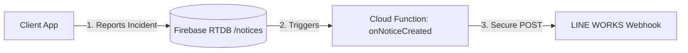

# Implementation Plan: LINE WORKS Incident Notifications (Secure & Configurable)

This plan describes how to integrate LINE WORKS with the Seibi application. When a technician logs a sudden incident or defect in the app, the system will instantly send a formatted notification to the team's LINE WORKS talkroom, with support for target mentions (like @All or specific users).

---

## Architecture Design: Cloud Database Trigger

Instead of making the HTTP call from the client-side browser, we will use a **Firebase Cloud Function Database Trigger**. 



### Why this is the right design:
1. **Security:** The LINE WORKS Webhook URL is hidden inside the backend Cloud Function. No one can steal the URL from the browser's Developer Tools to spam your channel.
2. **No CORS Issues:** Browsers block direct POST requests to messaging webhooks due to Cross-Origin Resource Sharing (CORS). Cloud Functions run on Node.js and bypass this.
3. **Offline Resilience:** If a technician reports a defect while offline, Firebase offline cache saves it. As soon as they regain connection, the database updates, triggering the cloud function and sending the notification.

---

## Step-by-Step Integration Guide

### Step 1: Set up the LINE WORKS Webhook (Manual Setup)
1. Go to your **LINE WORKS Developer Console** or **App Directory** and search for the **Incoming Webhook** app.
2. Add the app, choose a title (e.g., `Seibi Notice Bot`), and invite it to the target talkroom where notifications should go.
3. Under the Webhook settings, copy the generated **Webhook URL** (e.g., `https://webhook.worksmobile.com/r/xxxxxx/xxxxxx`). Keep this URL ready.

---

### Step 2: Implement the Cloud Function in functions/index.js
We will write the Gen 2 Database Trigger in [functions/index.js](file:///C:/Users/SHOP4/.gemini/antigravity/scratch/seibi-app/seibi-app-main/functions/index.js).

* **Target File:** [functions/index.js](file:///C:/Users/SHOP4/.gemini/antigravity/scratch/seibi-app/seibi-app-main/functions/index.js)
* **Trigger Event:** `onValueCreated` on database reference `notices/{noticeId}`.
* **Database Region:** `asia-southeast1` (Singapore) to match your database location.
* **Secrets Configuration:** We will use `defineString` from `firebase-functions/params` to define `LINE_WORKS_WEBHOOK_URL`. During deployment, the Firebase CLI will ask you to enter the Webhook URL, securing it.

#### Code Draft for `functions/index.js`:
Add this block at the end of the file:
```javascript
const { onValueCreated } = require('firebase-functions/v2/database');
const { defineString } = require('firebase-functions/params');

// Define Webhook parameter (Firebase CLI will ask for this during deploy)
const lineWorksWebhookUrl = defineString('LINE_WORKS_WEBHOOK_URL');

exports.sendLineWorksNotice = onValueCreated({
  ref: '/notices/{noticeId}',
  region: 'asia-southeast1' // Matches Singapore database location
}, async (event) => {
  try {
    const notice = event.data.val();
    if (!notice) return;

    // Only notify for incidents or defects
    if (notice.category !== 'incident' && notice.category !== 'defect') {
      console.log('Notice is not an incident/defect. Skipping LINE WORKS notification.');
      return;
    }

    const isIncident = notice.category === 'incident';
    const alertEmoji = isIncident ? '🚨' : '🔧';
    const alertTitle = isIncident ? '異常発生通知 (Incident Alert)' : '不具合報告 (Defect Report)';
    
    // Format message text with @All mention tag
    const messageText = `<m userId="all">\n${alertEmoji} ${alertTitle}\n\n■ 設備名 (Equipment): ${notice.assetName || 'Unassigned'}\n■ 内容 (Details): ${notice.text || 'No description provided'}\n■ 報告者 (Reporter): ${notice.author || 'Anonymous'}\n■ 日時 (Time): ${new Date(notice.createdAt).toLocaleString('ja-JP', { timeZone: 'Asia/Tokyo' })}`;

    const payload = {
      title: `${alertEmoji} Seibi Alert`,
      body: {
        text: messageText
      },
      button: {
        label: 'アプリを開く (Open Seibi)',
        url: 'https://seibi-app.web.app'
      }
    };

    const webhookUrl = lineWorksWebhookUrl.value();
    const response = await fetch(webhookUrl, {
      method: 'POST',
      headers: {
        'Content-Type': 'application/json'
      },
      body: JSON.stringify(payload)
    });

    if (response.ok) {
      console.log('Successfully sent notice to LINE WORKS.');
    } else {
      const errText = await response.text();
      console.error(`Failed to send notice to LINE WORKS. Status: ${response.status}, Error: ${errText}`);
    }

  } catch (error) {
    console.error('Error in sendLineWorksNotice trigger:', error);
  }
});
```

---

### Step 3: Deploy and Configure Webhook URL
Run this command in the project root:
```bash
firebase deploy --only functions
```
**During deployment:**
The Firebase CLI will detect the new parameter and output a prompt:
> `? Enter a value for LINE_WORKS_WEBHOOK_URL:`

Paste your Webhook URL there and press Enter. Firebase will automatically save it.

---

## Verification Plan

### Automated Verification
* Once deployed, write a mock notice object directly to `/notices` inside your Firebase Database Console.
* Verify the Cloud Function logs show `Status 200` from the worksmobile server.

### Manual Verification
1. Open the Seibi Web App.
2. Click **"Report Incident"** (sudden report) on any asset (e.g., Welding Robot #3).
3. Type an incident description and click submit.
4. Verify that a message immediately appears in the LINE WORKS talkroom containing the formatted incident details, mentions `@All` (or the specific user), and a button to open the app.
