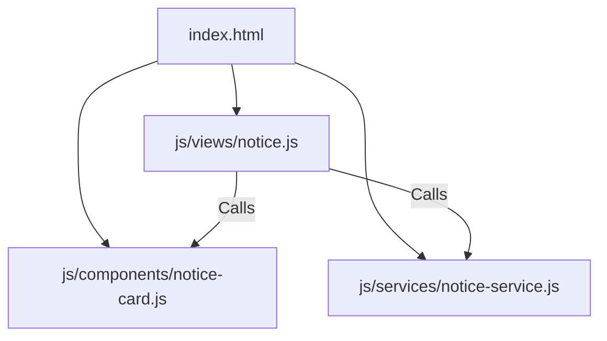

# Implementation Plan: Modular Refactoring of Notice Board View

This plan describes how to refactor the monolithic public/js/views/notice.js (43 KB, 893 lines) into three clean, single-responsibility files using the existing IIFE (Immediately Invoked Function Expression) architecture.

---

## User Review Required

* **Script Loading Order:** Since this project uses standard script tags instead of ES Modules, the new component and service files must be loaded in public/index.html **before** the main view file.
* **No Structural Break:** We will not convert the codebase to modern ES module imports (type="module"), as doing so would require rewriting how all global namespaces (App, I18n, Router) interact. We will stick to the project's current robust global namespace system.

---

## Proposed Changes

We will split the Notice Board view logic into three distinct layers:
1. **Component Layer (js/components/notice-card.js):** Renders HTML strings for notice board post cards, avatar bubbles, and resolution banners.
2. **Service Layer (js/services/notice-service.js):** Pure business logic (e.g., timezone/relative time calculation, avatar colors, filtering and searching notices).
3. **Controller Layer (js/views/notice.js):** Handles DOM bindings, event listeners, search input changes, modal operations, and submissions.



---

### 1. Create [NEW] js/components/notice-card.js
Extract all HTML string-building functions from the view. This file will only concern itself with what visual elements look like.

* **Functions to extract:**
  * _renderRepairBanner(notice): Generates HTML for resolved defect/incident banners.
  * _renderNotice(notice): Generates the HTML layout for individual notice cards.

---

### 2. Create [NEW] js/services/notice-service.js
Extract helper computations, formatting, and filtering logic from the view. This file contains no HTML generation or DOM calls.

* **Functions/Variables to extract:**
  * _relativeTime(isoStr): Computes and localizes time differences (e.g., "just now", "10m ago").
  * _avatarColour(initials): Generates a deterministic background color for user avatars.
  * filterAndSearchNotices(notices, activeFilter, searchQuery): Contains the filtering and search-matching logic.

---

### 3. [MODIFY] js/views/notice.js
We will clean up the view controller. It will now only bind click listeners, manage notice posting, handle search and filter changes, handle defect resolution modals, and trigger refreshes when language changes.

* **Key cleanups:**
  * Delete the HTML string builders (use the new NoticeCard component namespace).
  * Delete calculations and filtering functions (use the new NoticeService namespace).

---

### 4. [MODIFY] public/index.html
Register the new files in the scripts section, ensuring they load in the correct order.

```diff
  <script src="js/views/home.js?v=34"></script>
  <script src="js/views/calendar.js?v=34"></script>
  <script src="js/views/history.js?v=34"></script>
+ <script src="js/components/notice-card.js?v=34"></script>
+ <script src="js/services/notice-service.js?v=34"></script>
  <script src="js/views/notice.js?v=34"></script>
  <script src="js/components/asset-card.js?v=34"></script>
```

---

## Verification Plan

### Automated Verification
* Open browser Developer Tools and check the console. Ensure no load-order errors occur (Uncaught ReferenceError: NoticeCard is not defined).
* Run git diff on notice.js to ensure code line count decreases significantly.

### Manual Verification
1. **List Check:** Open the "Notice Board" tab and verify the posts load, show correct category tags, and relative times.
2. **Search & Filter Check:** Verify searching by text and filtering by "All", "Incidents", or "General" works.
3. **Incident Action Check:** Submit a new notice, and click "Resolve" on a defect. Verify the state updates correctly on the screen.
