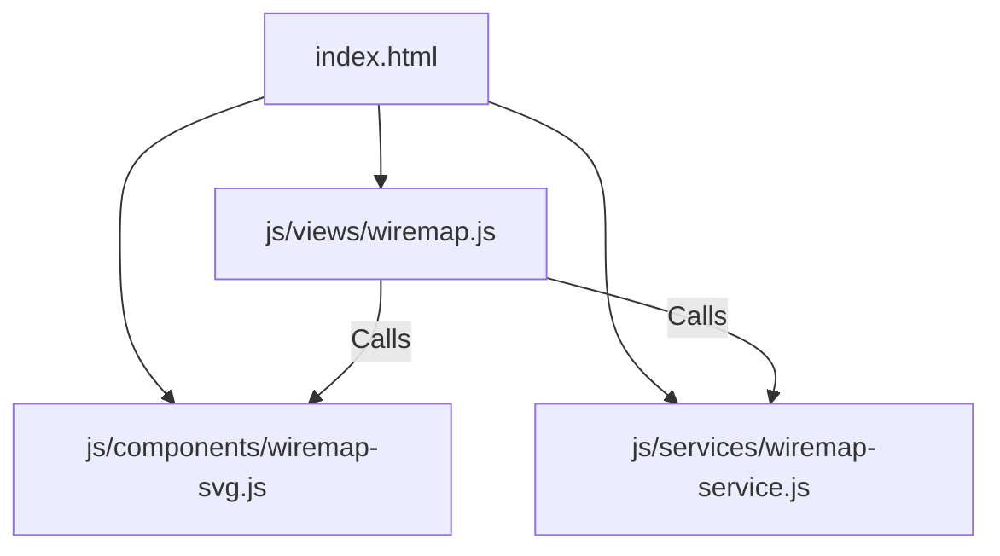

# Implementation Plan: Modular Refactoring of Wire Map View

This plan describes how to refactor the monolithic public/js/views/wiremap.js (27 KB, 688 lines) into three clean, single-responsibility files using the existing IIFE (Immediately Invoked Function Expression) architecture.

---

## User Review Required

* **Script Loading Order:** Since this project uses standard script tags instead of ES Modules, the new component and service files must be loaded in public/index.html **before** the main view file.
* **No Structural Break:** We will not convert the codebase to modern ES module imports (type="module"), as doing so would require rewriting how all global namespaces (App, I18n, Router) interact. We will stick to the project's current robust global namespace system.

---

## Proposed Changes

We will split the Wire Map view logic into three distinct layers:
1. **Component Layer (js/components/wiremap-svg.js):** Renders HTML/SVG strings for the workshop floor plan, background grids, room labels, and connection lines.
2. **Service Layer (js/services/wiremap-service.js):** Pure calculation and layout configuration. Handles equipment boundaries, coordinate clipping, and layout constants.
3. **Controller Layer (js/views/wiremap.js):** Handles DOM bindings, mouse/touch drag-and-drop listeners, toolbar actions, modals, details side panel, and layout edits.



---

### 1. Create [NEW] js/components/wiremap-svg.js
Extract all HTML/SVG generation functions from the view. This file only concerns itself with how visual layers are generated.

* **Functions to extract:**
  * _svgFloor(): Generates the background SVG including grid lines, walls, room boundaries, and labels.
  * _svgOverlay(): Draws SVG lines showing the connections/wires between equipment (TIG/CO2 welders, controllers, weld tables, robots, etc.).

---

### 2. Create [NEW] js/services/wiremap-service.js
Extract constants, coordinates, and bounding box validation logic. This file has no DOM dependencies and is purely functional.

* **Constants/Functions to extract:**
  * Visual configurations: `CFG` (type colors/labels) and `COND` (condition colors).
  * Room/canvas dimension constants: `W`, `H`, `R` (main room bounds), and `E` (storage extension bounds).
  * _boundPosition(cx, cy, radius, shape, rectW, rectH): Limits JST coordinate offsets to keep dragged elements strictly inside the walls.

---

### 3. [MODIFY] js/views/wiremap.js
We will clean up the view controller. It will now only bind click listeners, touch/mouse drag bindings, modal overlays, detail side panel text, and trigger database saves.

* **Key cleanups:**
  * Delete `_svgFloor` and `_svgOverlay` (use the new `WireMapSVG` component namespace).
  * Delete `_boundPosition` and config lists (use the new `WireMapService` namespace).

---

### 4. [MODIFY] public/index.html
Register the new files in the scripts section, ensuring they load in the correct order.

```diff
  <script src="js/views/assets.js?v=34"></script>
  <script src="js/data/wiremap.js?v=34"></script>
+ <script src="js/components/wiremap-svg.js?v=34"></script>
+ <script src="js/services/wiremap-service.js?v=34"></script>
  <script src="js/views/wiremap.js?v=34"></script>
  <script src="js/data/manuals.js?v=34"></script>
```

---

## Verification Plan

### Automated Verification
* Open browser Developer Tools and check the console. Ensure no load-order errors occur (Uncaught ReferenceError: WireMapSVG is not defined).
* Run git diff on wiremap.js to ensure code line count decreases significantly.

### Manual Verification
1. **Interactive Check:** Open the "Wire Map" tab. Verify the floor plan SVG, grid lines, and room names load.
2. **Details Check:** Click on any equipment node. Verify the side panel opens showing the list of connected wires.
3. **Edit Check:** Click "Edit Layout". Drag an equipment node, try to drag it outside the room boundaries, and verify it stays bounded. Click "Save" and verify the new position persists.
